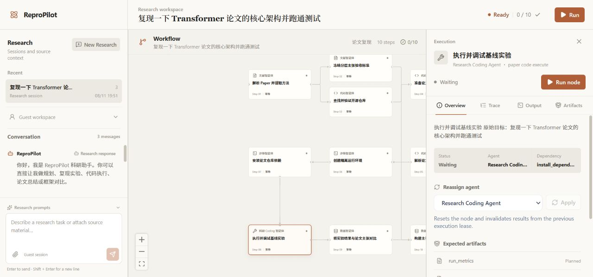
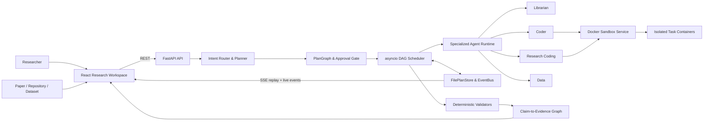

# ReproPilot

[](https://github.com/tutudouzi12/ReproPilot/actions/workflows/ci.yml)
[](https://www.python.org/)
[](https://fastapi.tiangolo.com/)
[](https://react.dev/)
[](https://www.docker.com/)

**把论文、仓库和数据集转化为可执行 DAG，并在受限 Docker 环境中完成调度、调试、验证与证据追踪的多 Agent 科研工作台。**

ReproPilot 不把一次模型回复当作研究结果。它将自然语言目标编译为带显式依赖、输入输出 Artifact、预算和审批条件的 `PlanGraph`，由 Python Runtime 驱动多个专业 Agent 协作执行，再使用确定性校验器重算指标、检查产物并构建 Claim-to-Evidence Graph。


## 从研究问题到可验证证据

```text
论文 / GitHub 仓库 / 数据集 / 自然语言目标
                    │
                    ▼
       Intent Router + Rule Planner
                    │
                    ▼
       PlanGraph（依赖、契约、预算、审批）
                    │
                    ▼
       asyncio DAG Scheduler + Agent Runtime
                    │
          ┌─────────┴─────────┐
          ▼                   ▼
  Docker Sandbox       Event / Artifact Store
          │                   │
          └─────────┬─────────┘
                    ▼
       Deterministic Validators
                    │
                    ▼
  Metrics / Reports / Claim-to-Evidence Graph
```

一次完整任务包含四个相互约束的阶段：

1. **组织研究上下文**：在 Research Workspace 中维护会话，附加论文、代码仓库或数据文件，并通过 PDF 阅读器直接处理原文。
2. **生成可审计计划**：Planner 识别论文复现、框架评测、自有数据 Benchmark、代码执行等意图，生成显式 DAG；高风险或 full 计划先进入审批门禁。
3. **治理真实执行**：Scheduler 只调度依赖已满足的节点，并处理并发、超时、重试、取消、预算、恢复和 Agent Reassign。
4. **验证而非宣告成功**：确定性组件校验路径、哈希、逐样本预测、指标与证据引用；证据不足时明确降级，不生成伪成功结果。

## 新版 Research Workspace

新版界面把会话、研究上下文、DAG 和节点级执行细节放进同一工作区：

- **会话与附件**：新建或切换研究会话，上传论文与数据；用户身份和会话身份会参与计划、附件与事件的所有权校验。
- **Workflow DAG**：React Flow 展示节点依赖、Agent 类型、步骤编号和实时状态；SSE 事件到达后同步更新节点和全局进度。
- **Execution Inspector**：每个节点都可以查看 Overview、Trace、Output 和 Artifacts，并单独运行、重试或重新分配 Agent。
- **研究产物视图**：报告、图片和 Claim-to-Evidence Graph 使用独立展示模式，不需要从原始日志里手工寻找结果。
- **PDF Assist**：使用本地 PDF.js Worker 渲染论文，支持缩放、文本层划词、翻译和携带原文的追问草稿。



## 核心工程能力

| 能力 | 实现方式 | 解决的问题 |
|---|---|---|
| DAG 编排 | 确定性图模板、显式依赖、优先级、超时和并发上限 | 长链路任务不再依赖单轮对话隐式推进 |
| 可恢复执行 | 原子 JSON Snapshot、启动恢复、事件历史回放 | 服务中断后保留已完成节点和 Artifact |
| 迟到结果隔离 | `execution_id`、递增 epoch 与执行租约 | 重试、取消或 Reassign 后旧协程不能覆盖新状态 |
| 专业 Agent 路由 | Librarian、Coder、Research Coding、Sandbox、Data | 将检索、代码、运行和证据分析拆成可治理职责 |
| 受限代码修复 | 有界上下文、路径校验、修改白名单、SHA-256 与自动回滚 | 防止模型获得任意文件系统或 Shell 写权限 |
| Benchmark Harness | 数据画像、Adapter、预检修复、正式执行、指标重算 | 模型不能用汇总文本冒充逐样本评测结果 |
| Claim-to-Evidence | 冻结 Rubric、Artifact 引用校验、分层结论状态 | 区分完整复现、部分复现、冲突和证据缺失 |
| 预算约束 ToT | 候选生成、评分与实验/GPU/总时长预算选择 | 消融设计在明确资源边界内搜索高价值分支 |
| 隔离执行 | 独立 FastAPI Sandbox、Docker SDK、资源和能力限制 | 将 Agent 决策与真实代码执行边界分离 |

## 系统架构



### 服务职责

| 层 | 主要职责 | 技术实现 |
|---|---|---|
| Research Workspace | 会话、附件、DAG、PDF、节点检查器与 Artifact 展示 | React 19、TypeScript、React Flow、PDF.js |
| API & Planner | 身份、上传、意图路由、图模板、审批和 PDF 安全代理 | FastAPI、Pydantic |
| Agent Runtime | Agent 路由、结构化输出契约、研究执行与报告 | Python 3.11、OpenAI-compatible API |
| DAG Scheduler | 并发、状态机、租约、重试、取消、预算与恢复 | `asyncio`、原子 JSON Snapshot |
| Sandbox | 容器生命周期、命令流、资源限制和执行隔离 | FastAPI、docker-py |
| Verification | Benchmark 重算、Rubric、Artifact 和证据图校验 | 确定性 Python 组件、SHA-256 |

## 调度、恢复与 Reassign 语义

Scheduler 根据依赖关系将节点从 `pending` 推进到 `ready`，并按优先级并发执行。失败节点在额度内重试，无法继续的下游节点进入 `blocked`；取消、失败、跳过和阻断是独立终态，不会被成功文案覆盖。

每次节点尝试都会绑定：

```text
task_id + execution_id + execution_epoch + lease_owner + lease_expires_at
```

当用户重试、取消或重新分配 Agent 时，Runtime 会递增 `execution_epoch` 并使旧租约失效。Agent 返回结果后，Scheduler 会重新读取持久化状态并核对执行标识、epoch 和租约所有者；不匹配的结果只产生 `task_result_discarded` 事件，不能写入节点状态或 Artifact。

`FilePlanStore` 使用“临时文件写入 → `fsync` → 原子替换”保存计划和事件。服务重启后，中断节点恢复为可重新调度状态，旧执行租约被清理，已完成节点及其 Artifact 保持不变。

## 论文、仓库与数据执行链路

### 论文复现

```text
Paper Parse
  → Freeze Claim Rubric
  → Repository Discovery
  → Workspace Preparation
  → Dependency Resolution
  → Isolated Runtime
  → Baseline / Repair / Rerun
  → Result Comparison
  → Claim-to-Evidence Graph
```

Research Coding Agent 只允许修改已经提供给模型的工作区文件。写入前会校验路径、符号链接、文件大小和禁止副作用，保存原内容及权限并记录前后 SHA-256；执行失败或修复预算耗尽时自动恢复修改。

### 自有数据 Benchmark

```text
Dataset Profile
  → Repository Discovery
  → Adapter Generation
  → Bounded Preflight & Repair
  → Benchmark Execution
  → Prediction / Metric Validation
  → Evidence Report
```

- 支持 CSV、TSV、JSON 和 JSONL，以及分类、回归和无标签推理任务。
- `dataset_profile` 以确定性代码解析列、样本数、任务类型和数据 SHA-256。
- 预检最多执行 3 轮、每轮最多使用 8 条样本；正式执行输出逐样本 `predictions.jsonl` 和运行清单。
- Validator 重新读取预测，核对数据哈希和样本数，并独立重算 `accuracy`、`macro_f1`、`mse` 或 `mae`。
- Adapter、数据或仓库源码出现未授权变化时，整次评测失败。

### Claim-to-Evidence Graph

论文主张先被拆分为可独立验收的分层 Rubric 并冻结哈希，随后才允许节点引用真实存在的 Artifact。每项主张会得到明确状态：

| 状态 | 含义 |
|---|---|
| `verified` | Artifact 满足冻结的验收条件 |
| `partially_reproduced` | 只覆盖部分条件或缩小规模实验 |
| `contradicted` | 运行证据与目标主张冲突 |
| `unverifiable` | 当前证据不足，无法可靠判断 |
| `blocked_by_missing_asset` | 缺少数据、Checkpoint 或其他必要资产 |

离线演示产物统一标记为 `unverified_demo`，并从有效报告、绘图和 Evidence Graph 中排除。

## PDF 与附件研究链路

- 文件上传会校验所有权、类型、大小和 SHA-256，并只向外部响应返回安全元数据。
- 上传 PDF 的内容地址与消息动作绑定，点击后打开实际附件，不使用固定示例地址。
- 远程 PDF 代理只接受受信 HTTPS 目标，拒绝用户信息、回环、私网、链路本地和组播地址；不自动跟随重定向，并限制响应类型与大小。
- PDF.js Worker 随前端镜像本地部署；文本层支持划词后翻译，也可以将选中原文带入后续研究问题。

## Docker Sandbox 安全模型

Backend 仅通过内部 Bearer Token 调用独立 Sandbox Service。每个任务容器默认使用：

| 控制项 | 默认值 |
|---|---|
| 镜像 | 精确 allowlist |
| 挂载目录 | `SANDBOX_WORKSPACE_ROOTS` 白名单 |
| 网络 | `network_mode=none` |
| CPU | 1 core |
| 内存 | 512 MiB |
| 进程数 | 128 PIDs |
| Linux capabilities | `cap_drop=ALL` |
| Privilege escalation | `no-new-privileges` |
| 单命令超时 | 300 秒 |
| 输出上限 | 1 MiB，UTF-8 安全截断 |

命令输出通过 NDJSON 传输 stdout、stderr 和 final 事件，任务完成、失败或取消后清理容器。GPU 必须通过显式 `DeviceRequest` 启用。

> Sandbox Service 仍需要访问 Docker Socket，因此它适合受控开发和研究环境。若直接服务不可信公网租户，应把执行面迁移到独立 Worker、rootless runtime、gVisor/Kata 或云端短生命周期沙箱。

## 快速启动

需要 Docker Desktop（或兼容 Docker Engine）。

```powershell
git clone https://github.com/tutudouzi12/ReproPilot.git
cd ReproPilot
Copy-Item backend.env.example backend.env
docker compose up --build -d
docker compose ps
```

| 服务 | 地址 |
|---|---|
| Research Workspace | http://localhost:5173 |
| Backend API | http://localhost:8080 |
| OpenAPI Docs | http://localhost:8080/docs |
| Sandbox Health | http://localhost:8082/api/v1/health |

### 配置模型

ReproPilot 使用 OpenAI-compatible Chat Completions 接口。需要模型能力时，在 `backend.env` 中配置：

```dotenv
OPENAI_API_KEY=your-key
OPENAI_BASE_URL=https://your-compatible-endpoint/v1
OPENAI_MODEL=your-model
```

`OFFLINE_DEMO_MODE=false` 是默认严格模式：缺少模型、仓库工作区或 Sandbox 时，相关执行节点会失败并保留真实原因。只有界面和 DAG 联调时才应显式启用演示模式；演示产物不会升级为有效研究证据。

### 本地开发

需要 Python 3.11+、Node.js 20+ 和 Docker。

```powershell
Copy-Item backend.env.example backend.env

py -3.11 -m pip install -e ".\backend[dev]"
py -3.11 -m pip install -e ".\docker-sandbox[dev]"

.\scripts\windows\start-sandbox.ps1
.\scripts\windows\start-backend.ps1
.\scripts\windows\start-frontend.ps1
```

Windows 与 Unix 启动脚本都位于 [`scripts/`](scripts/) 目录。

## API 与实时事件

| Method | Endpoint | 用途 |
|---|---|---|
| `POST` | `/api/plan` | 解析意图并创建 PlanGraph |
| `GET` | `/api/plans/{plan_id}` | 读取计划、节点与 Artifact |
| `POST` | `/api/plans/{plan_id}/approve` | 批准待审批计划 |
| `POST` | `/api/plans/{plan_id}/execute` | 启动计划执行 |
| `POST` | `/api/plans/{plan_id}/cancel` | 取消计划并使未完成租约失效 |
| `POST` | `/api/plans/{plan_id}/tasks/{task_id}/retry` | 重置失败节点及受阻塞下游 |
| `POST` | `/api/plans/{plan_id}/tasks/{task_id}/reassign` | 更换 Agent 并递增 execution epoch |
| `GET` | `/api/plans/{plan_id}/events` | 获取可回放事件历史 |
| `GET` | `/api/plans/{plan_id}/stream` | 订阅 SSE 实时事件流 |
| `POST` | `/api/uploads` | 上传论文、代码或数据附件 |
| `GET` | `/api/uploads/{upload_id}/content` | 读取已授权附件内容 |
| `GET` | `/api/pdf-proxy` | 安全代理受信远程 PDF |

SSE 事件覆盖 `plan_started`、`task_ready`、`task_started`、`task_log`、`artifact_created`、`task_completed`、`task_result_discarded`、`task_reassigned` 和计划终态。客户端先订阅再回放历史，并通过事件指纹去重，避免连接建立期间遗漏或重复消息。

## 可复现验证

截至 2026-08-11，合并后的主分支完成了以下验证：

| 验证层 | 结果 |
|---|---|
| Backend | `133 passed, 2 skipped` |
| Docker Sandbox | `7 passed` |
| Frontend | ESLint、TypeScript 与 Vite production build 通过 |
| Dependency Audit | `npm audit --omit=dev`：`0 vulnerabilities` |
| Docker Compose | Frontend、Backend、Sandbox 三个服务健康启动 |
| Docker Smoke | Token、白名单、网络/资源限制、真实执行、超时、截断和清理通过 |
| Chrome E2E | 附件、DAG、Reassign、PDF Worker、15 页论文渲染、划词翻译/追问和严格失败提示通过 |
| GitHub Actions | `test` 与 `docker-smoke` 两个 Job 通过 |

验证中还完成了两条真实执行证据：

- 在 `karpathy/minGPT` 固定提交 `37baab71b9abea1b76ab957409a1cc2fbfba8a26` 上完成 Repository Preparation，并在隔离容器内执行受限前向传播，得到输出形状 `[2, 7, 64]`、参数量 `167680`；运行结束后无任务容器泄漏。
- Benchmark Harness 完成 preflight、execution 和 validation，并从逐样本预测独立重算 `accuracy=0.5`、`macro_f1=0.3333333333333333`。

本地质量检查：

```powershell
Push-Location backend
py -3.11 -m pytest -q
Pop-Location

Push-Location docker-sandbox
py -3.11 -m pytest -q
Pop-Location

Push-Location frontend
npm ci
npm run lint
npm run build
npm audit --omit=dev
Pop-Location

py -3.11 .\scripts\docker_smoke.py
```

## 项目结构

```text
ReproPilot/
├── backend/
│   ├── app/
│   │   ├── planner.py              # 意图路由与 DAG 模板
│   │   ├── scheduler.py            # 调度、租约、预算与恢复
│   │   ├── agents.py               # Agent 路由与结构化执行契约
│   │   ├── research_coding.py      # 受限修复、回滚与重跑
│   │   ├── benchmark*.py           # 数据契约、执行与指标重算
│   │   ├── claim_evidence.py       # Rubric 与 Evidence Graph
│   │   ├── safe_http.py            # PDF SSRF 与响应边界
│   │   └── store.py                # 原子计划快照
│   └── tests/
├── docker-sandbox/                 # 独立 Docker 执行服务
├── frontend/                       # React Research Workspace
├── docs/                           # 架构、运行时与使用文档
├── examples/                       # 最小研究复现样例
├── scripts/                        # 启动脚本与 Docker Smoke
├── test/                           # Claim-Evidence 可复现样例
├── docker-compose.yml
└── backend.env.example
```

## 设计边界与扩展方向

- 当前计划与事件存储面向可靠单节点部署；多副本调度需要迁移到事务数据库并引入分布式租约或 leader election。
- API 静态 Token、Header 身份和 Cookie 会话适合本地产品工作流；公网部署需要可信认证网关、OIDC/RBAC 和不可伪造审计身份。
- 私有仓库、受限数据集、私有 Checkpoint、交互式 GUI 和高度定制的数据加载协议需要额外集成。
- 代码修复成功只证明对应执行错误已消除，不自动证明论文方法、数据口径或科学结论已经完整复现。

## 文档

- [系统架构](docs/project_architecture.md)
- [Agent Runtime 可靠性与治理](docs/agent_runtime_p0_p1.md)
- [Research Coding Agent 与 Benchmark Harness](docs/research_coding_agent.md)
- [Claim-to-Evidence Graph](docs/claim_evidence_graph.md)
- [ToT 消融、上传与安全边界](docs/tot_ablation_and_uploads.md)
- [本地启动指南](docs/local_startup_guide.md)
- [用户手册](docs/user_manual.md)
- [贡献指南](docs/CONTRIBUTING.md)
