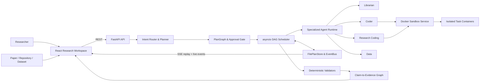

<div align="center">
  <h1>ReproPilot</h1>
  <h3>Evidence-driven research execution for papers, repositories, and datasets</h3>
  <p>将研究目标编译为可执行 DAG，在隔离环境中完成多 Agent 协作、代码调试、指标验证与证据追踪。</p>
  <p>
    <a href="https://github.com/tutudouzi12/ReproPilot/actions/workflows/ci.yml"></a>
    <a href="https://www.python.org/"></a>
    <a href="https://fastapi.tiangolo.com/"></a>
    <a href="https://react.dev/"></a>
    <a href="https://www.docker.com/"></a>
  </p>
  <p>
    <a href="#why-repropilot">Why ReproPilot</a> ·
    <a href="#architecture">Architecture</a> ·
    <a href="#validation">Validation</a> ·
    <a href="#documentation">Documentation</a>
  </p>
</div>


## Why ReproPilot

论文复现不是一次问答，而是一条包含论文解析、仓库发现、环境准备、代码执行、失败修复、指标对齐和证据审定的长链路。ReproPilot 将这条链路建模为可持久化的 `PlanGraph`：模型负责提出结构化方案，Python Runtime 负责治理执行，确定性组件负责认定结果。

- **Durable execution** — DAG 状态、事件和 Artifact 原子持久化；服务重启后恢复未完成节点。
- **Governed agents** — 每个节点声明依赖、输入输出、工具权限、超时、重试和预算，不依赖隐式对话状态推进。
- **Evidence before claims** — 指标由 Validator 重算，论文主张必须引用真实 Artifact，证据不足时明确降级。
- **Bounded code repair** — Research Coding Agent 只能修改已提供上下文中的文件，并记录哈希、回滚失败补丁。
- **Isolated execution** — 代码在独立 Docker Sandbox 中运行，应用镜像、挂载、网络、资源和权限限制。

## Research Workspace

ReproPilot 将会话、研究上下文、DAG 和节点级执行细节整合在同一工作区：

- **Sessions & attachments**：维护研究会话，上传论文、代码和数据；计划与附件受用户和会话所有权约束。
- **Workflow DAG**：React Flow 展示节点依赖、Agent 类型和实时状态，SSE 同步执行进度。
- **Execution Inspector**：查看节点 Overview、Trace、Output 和 Artifacts，并执行重试或 Agent Reassign。
- **Research artifacts**：以独立视图展示报告、图片和 Claim-to-Evidence Graph。
- **PDF Assist**：本地 PDF.js Worker 支持论文渲染、缩放、划词翻译和携带原文追问。


## Core capabilities

| Capability | Implementation | Guarantee |
|---|---|---|
| Research-to-DAG planning | 意图路由、确定性图模板、审批门禁 | 计划拓扑和执行条件可审计 |
| Durable scheduling | `asyncio` 并发、原子 Snapshot、事件回放 | 中断后保留已完成节点和产物 |
| Execution isolation | execution ID、epoch、lease | 迟到结果不能覆盖新状态 |
| Research Coding | 有界上下文、文件白名单、SHA-256、自动回滚 | 模型不能获得任意写入权限 |
| Benchmark Harness | 数据画像、Adapter、预检、逐样本预测、指标重算 | 模型不能自行宣布评测成功 |
| Claim-to-Evidence | 冻结 Rubric、Artifact 引用校验、分层结论状态 | 区分完整、部分、冲突和不可验证结论 |
| Bounded ToT ablation | 候选生成、评分、实验/GPU/时长预算 | 在资源边界内选择高价值消融分支 |
| Docker Sandbox | 独立服务、镜像和挂载白名单、资源限制 | Agent 决策与真实代码执行分离 |

## Architecture



| Layer | Responsibility | Stack |
|---|---|---|
| Research Workspace | 会话、附件、DAG、PDF、节点检查器和 Artifact | React 19、TypeScript、React Flow、PDF.js |
| API & Planner | 身份、上传、意图路由、图模板、审批和 PDF 安全代理 | FastAPI、Pydantic |
| Agent Runtime | Agent 路由、结构化输出、研究执行和报告 | Python 3.11、OpenAI-compatible API |
| DAG Scheduler | 并发、状态机、租约、重试、取消、预算和恢复 | `asyncio`、原子 JSON Snapshot |
| Sandbox | 容器生命周期、命令流、资源限制和执行隔离 | FastAPI、docker-py |
| Verification | Benchmark 重算、Rubric、Artifact 和证据图校验 | 确定性 Python、SHA-256 |

## Runtime guarantees

### Lease-based stale result isolation

Scheduler 只运行依赖已满足的节点。每次节点尝试都会绑定：

```text
task_id + execution_id + execution_epoch + lease_owner + lease_expires_at
```

重试、取消或 Agent Reassign 会递增 `execution_epoch` 并使旧租约失效。Agent 返回后，Scheduler 重新读取持久化状态并核对执行标识、epoch 和租约所有者；不匹配的结果只产生 `task_result_discarded` 事件，不能写入节点状态或 Artifact。

### Recovery and event replay

- `FilePlanStore` 按“临时文件 → `fsync` → 原子替换”保存计划和事件。
- 服务启动时清理中断节点的旧租约并恢复调度，已完成节点及其 Artifact 保持不变。
- SSE 先订阅再回放历史，并使用事件指纹去重，避免连接建立期间遗漏或重复事件。
- 计划支持审批、取消、失败节点重试、尝试次数预算和总执行时长预算。

## Research verification

### Paper reproduction

```text
Paper Parse → Freeze Claim Rubric → Repository Discovery
→ Workspace & Dependencies → Isolated Execution → Repair / Rerun
→ Result Comparison → Claim-to-Evidence Graph
```

Research Coding Agent 只允许修改模型已看到的工作区文件。写入前校验路径、符号链接、文件大小和禁止副作用，记录修改前后 SHA-256；执行失败或修复预算耗尽时恢复原文件。

### Custom benchmark

```text
Dataset Profile → Adapter Generation → Bounded Preflight & Repair
→ Benchmark Execution → Prediction / Metric Validation → Evidence Report
```

- 支持 CSV、TSV、JSON 和 JSONL，以及分类、回归和无标签推理任务。
- 预检最多执行 3 轮、每轮最多使用 8 条样本。
- 正式执行输出逐样本 `predictions.jsonl` 和运行清单。
- Validator 核对数据哈希和样本数，并独立重算 `accuracy`、`macro_f1`、`mse` 或 `mae`。
- Adapter、数据或仓库源码出现未授权变化时，评测失败。

### Claim-to-Evidence and ablation

论文主张先被拆分为可独立验收的 Rubric 并冻结哈希，随后才允许引用真实 Artifact。判定结果包括 `verified`、`partially_reproduced`、`contradicted`、`unverifiable` 和 `blocked_by_missing_asset`。

ToT 消融在候选生成后按信息增益、相关性、可复现性和风险评分，并受实验数、GPU 分钟和总时长预算约束。被选中的分支会进入真实执行配置，而不只是改变报告文字。

## Sandbox security

Backend 通过内部 Bearer Token 调用独立 Sandbox Service。任务容器默认应用：

| Control | Default |
|---|---|
| Image | 精确 allowlist |
| Mounts | `SANDBOX_WORKSPACE_ROOTS` 白名单 |
| Network | `network_mode=none` |
| CPU | 1 core |
| Memory | 512 MiB |
| Processes | 128 PIDs |
| Capabilities | `cap_drop=ALL` |
| Privilege escalation | `no-new-privileges` |
| Command timeout | 300 seconds |
| Output | 1 MiB，UTF-8 安全截断 |

stdout、stderr 和 final 事件通过 NDJSON 传输；任务完成、失败或取消后清理容器。GPU 必须通过显式 `DeviceRequest` 启用。

## API

| Method | Endpoint | Purpose |
|---|---|---|
| `POST` | `/api/plan` | 解析意图并创建 PlanGraph |
| `GET` | `/api/plans/{plan_id}` | 读取计划、节点和 Artifact |
| `POST` | `/api/plans/{plan_id}/approve` | 批准待审批计划 |
| `POST` | `/api/plans/{plan_id}/execute` | 启动计划 |
| `POST` | `/api/plans/{plan_id}/cancel` | 取消计划并使未完成租约失效 |
| `POST` | `/api/plans/{plan_id}/tasks/{task_id}/retry` | 重置失败节点及受阻塞下游 |
| `POST` | `/api/plans/{plan_id}/tasks/{task_id}/reassign` | 更换 Agent 并递增 execution epoch |
| `GET` | `/api/plans/{plan_id}/events` | 获取可回放事件历史 |
| `GET` | `/api/plans/{plan_id}/stream` | 订阅 SSE 实时事件 |
| `POST` | `/api/uploads` | 上传论文、代码或数据附件 |
| `GET` | `/api/uploads/{upload_id}/content` | 读取已授权附件 |
| `GET` | `/api/pdf-proxy` | 安全代理受信远程 PDF |

SSE 事件覆盖节点 ready、start、log、Artifact、终态、Reassign、迟到结果丢弃和计划终态。完整 Schema 可在 [OpenAPI](http://localhost:8080/docs) 中查看。

## Validation

| Check | Result |
|---|---|
| Backend | `133 passed, 2 skipped` |
| Docker Sandbox | `7 passed` |
| Frontend | ESLint、TypeScript、Vite production build 通过 |
| Dependency Audit | `npm audit --omit=dev`：`0 vulnerabilities` |
| Docker Compose | Frontend、Backend、Sandbox 健康启动 |
| Docker Smoke | Token、白名单、资源限制、真实执行、超时、截断和清理通过 |
| Browser E2E | 附件、DAG、Reassign、PDF Worker、论文渲染、划词翻译/追问和严格失败提示通过 |
| GitHub Actions | `test` 与 `docker-smoke` 通过 |

<details>
<summary><strong>Reproducible execution evidence</strong></summary>

- 在 `karpathy/minGPT` 固定提交 `37baab71b9abea1b76ab957409a1cc2fbfba8a26` 上完成 Repository Preparation；隔离容器内的受限前向传播得到输出形状 `[2, 7, 64]`、参数量 `167680`，运行后无任务容器泄漏。
- Benchmark Harness 完成 preflight、execution 和 validation，并从逐样本预测独立重算 `accuracy=0.5`、`macro_f1=0.3333333333333333`。

</details>

```powershell
Push-Location backend
py -3.11 -m pytest -q
Pop-Location

Push-Location docker-sandbox
py -3.11 -m pytest -q
Pop-Location

Push-Location frontend
npm ci
npm run lint
npm run build
npm audit --omit=dev
Pop-Location

py -3.11 .\scripts\docker_smoke.py
```

## Quickstart

需要 Docker Desktop 或兼容的 Docker Engine。

```powershell
git clone https://github.com/tutudouzi12/ReproPilot.git
cd ReproPilot
Copy-Item backend.env.example backend.env
docker compose up --build -d
docker compose ps
```

| Service | URL |
|---|---|
| Research Workspace | http://localhost:5173 |
| Backend API | http://localhost:8080 |
| OpenAPI Docs | http://localhost:8080/docs |
| Sandbox Health | http://localhost:8082/api/v1/health |

ReproPilot 使用 OpenAI-compatible Chat Completions 接口。需要模型能力时，在 `backend.env` 中配置：

```dotenv
OPENAI_API_KEY=your-key
OPENAI_BASE_URL=https://your-compatible-endpoint/v1
OPENAI_MODEL=your-model
```

`OFFLINE_DEMO_MODE=false` 是默认严格模式。缺少模型、仓库工作区或 Sandbox 时，相关节点会失败并保留真实原因。演示模式产生的内容统一标记为 `unverified_demo`，不会进入有效研究证据。

<details>
<summary><strong>Local development</strong></summary>

需要 Python 3.11+、Node.js 20+ 和 Docker。

```powershell
Copy-Item backend.env.example backend.env

py -3.11 -m pip install -e ".\backend[dev]"
py -3.11 -m pip install -e ".\docker-sandbox[dev]"

.\scripts\windows\start-sandbox.ps1
.\scripts\windows\start-backend.ps1
.\scripts\windows\start-frontend.ps1
```

Windows 与 Unix 启动脚本都位于 [`scripts/`](scripts/) 目录。

</details>

## Repository layout

```text
ReproPilot/
├── backend/
│   ├── app/
│   │   ├── planner.py              # intent routing and DAG templates
│   │   ├── scheduler.py            # scheduling, leases, budgets, recovery
│   │   ├── agents.py               # agent routing and execution contracts
│   │   ├── research_coding.py      # bounded repair, rollback, rerun
│   │   ├── benchmark*.py           # dataset contracts and metric validation
│   │   ├── claim_evidence.py       # rubric and evidence graph
│   │   ├── safe_http.py            # PDF SSRF and response boundaries
│   │   └── store.py                # atomic plan snapshots
│   └── tests/
├── docker-sandbox/                 # isolated Docker execution service
├── frontend/                       # React Research Workspace
├── docs/                           # architecture and user documentation
├── examples/                       # minimal reproduction examples
├── scripts/                        # startup helpers and Docker smoke test
├── test/                           # reproducible Claim-Evidence example
├── docker-compose.yml
└── backend.env.example
```

## Documentation

- [System architecture](docs/project_architecture.md)
- [Agent Runtime reliability and governance](docs/agent_runtime_p0_p1.md)
- [Research Coding Agent and Benchmark Harness](docs/research_coding_agent.md)
- [Claim-to-Evidence Graph](docs/claim_evidence_graph.md)
- [ToT ablation, uploads, and security](docs/tot_ablation_and_uploads.md)
- [Local startup guide](docs/local_startup_guide.md)
- [User manual](docs/user_manual.md)
- [Contributing](docs/CONTRIBUTING.md)

## Operational boundaries

- `FilePlanStore` 面向可靠单节点部署；多副本调度需要事务数据库、分布式租约或 leader election。
- API Token、Header 身份和 Cookie 会话适合本地产品工作流；公网部署需要可信认证网关、OIDC/RBAC 和不可伪造审计身份。
- Sandbox Service 可以访问 Docker Socket。服务不可信公网租户时，应将执行面迁至独立 Worker、rootless runtime、gVisor/Kata 或云端短生命周期沙箱。
- 私有仓库、受限数据集、私有 Checkpoint、交互式 GUI 和高度定制的数据加载协议需要额外集成。
- 代码修复成功只证明对应执行错误已消除，不自动证明论文方法、数据口径或科学结论已经完整复现。
