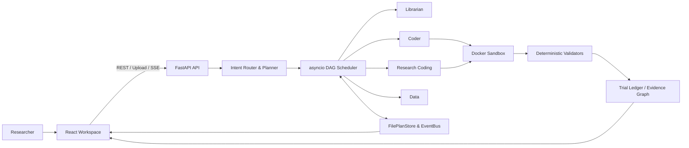

<div align="center">
  <h1>ReproPilot</h1>
  <h3>Evidence-driven multi-agent research execution</h3>
  <p>将论文、仓库与数据任务编译为可恢复 DAG，让专业 Agent 在受控环境中修改代码、执行实验并交付可审计证据。</p>
  <p>
    <a href="https://github.com/tutudouzi12/ReproPilot/actions/workflows/ci.yml"></a>
    <a href="https://www.python.org/"></a>
    <a href="https://fastapi.tiangolo.com/"></a>
    <a href="https://react.dev/"></a>
    <a href="https://www.docker.com/"></a>
  </p>
  <p>
    <a href="#four-engineering-pillars">Four Pillars</a> ·
    <a href="#15-second-visual-walkthrough">15-second Demo</a> ·
    <a href="#architecture">Architecture</a> ·
    <a href="#validation">Validation</a> ·
    <a href="#quickstart">Quickstart</a>
  </p>
</div>


ReproPilot 解决的不是一次模型问答，而是一条长时间研究执行链：理解目标、分工、准备仓库、受控修改代码、隔离运行、重新计算指标并沉淀证据。模型负责理解和提出候选；Python Runtime 掌握状态转移、文件写入、执行、验收与回滚。

## Four engineering pillars

### 1. Contract-driven multi-agent DAG runtime

Planner 将任务编译为带显式依赖的 `PlanGraph`，并通过类型化 Artifact 连接 Librarian、Coder、Research Coding、Sandbox 与 Data Agent。自研 `asyncio` Scheduler 管理 ready-node 调度、超时、重试、取消和 Agent Reassign；`execution_id + execution_epoch + lease` 使旧 Worker 的迟到结果无法覆盖新状态。计划、事件与 Artifact 原子持久化，服务重启后可恢复未完成任务，SSE 提供事件回放与实时进度。

### 2. Governed Research Coding and AutoResearch

Research Coding Agent 只负责诊断、假设和候选修改，确定性 Harness 掌握真实写入与接受权。`ResearchSpec` 冻结 Git revision、文件白名单、评测命令、重复次数和预算；baseline 与候选按同一契约重复执行，只有达到 `min_delta` 才 Keep，否则 Reject 并回滚。达到目标分数时由 Harness 停止搜索，最终验收不再调用候选模型。

### 3. Deterministic evaluation and auditable evidence

系统不接受模型自报的成功或汇总指标。Benchmark Validator 核对数据哈希、样本数、运行清单和逐样本预测后独立重算指标；AutoResearch 记录 Trial Ledger、补丁哈希和模型用量，并使用模型不可见 holdout 重复验收。论文复现通过冻结 Rubric 和 Claim-to-Evidence Graph 将每项主张绑定到真实 Artifact，证据不足时明确标记为部分复现、冲突或不可验证。

### 4. Isolated tool execution and security boundaries

独立 Docker Sandbox Service 管理任务容器，限制镜像、挂载根目录、网络、CPU、内存、PID、Linux capabilities、命令时长和输出大小；任务完成、失败、超时或取消后清理容器。上传链路校验文件所有权与哈希，远程 PDF 代理拒绝回环、私网和链路本地目标。它是受限单机执行面，不被包装成零信任多租户云沙箱。

## 15-second visual walkthrough


真实模型与 Docker 案例：8/8 节点约 26 秒完成；公开分数 `0.6667 → 1.0`，经历 1 次 Reject 和 1 次 Keep；模型不可见 holdout `3/3` 通过且文件完整。动图每 15 秒自动循环；输入、过程和证据边界见 [End-to-end demo](docs/end-to-end-demo.md)。

## Architecture



The key boundary is deliberate: LLMs propose structured work, while deterministic components own authorization, persistence, execution, scoring and acceptance. See [Design decisions and limitations](docs/design-decisions.md).

## Validation

| Check | Result |
|---|---|
| Backend | `146 passed, 2 skipped` |
| Docker Sandbox | `7 passed` |
| Frontend | ESLint、TypeScript、Vite production build 通过 |
| Dependency audit | `npm audit --omit=dev`：`0 vulnerabilities` |
| Docker Compose | Frontend、Backend、Sandbox 健康启动 |
| Docker smoke | 鉴权、白名单、资源限制、真实执行、超时、截断和清理通过 |
| GitHub Actions | Backend、Sandbox、Frontend 与 Docker smoke jobs |

上述状态区分单元测试、容器 Smoke 和真实模型案例；它们不等于公网生产部署或大规模论文复现成功率。

```powershell
Push-Location backend
py -3.11 -m pytest -q
Pop-Location

Push-Location docker-sandbox
py -3.11 -m pytest -q
Pop-Location

Push-Location frontend
npm ci
npm run lint
npm run build
npm audit --omit=dev
Pop-Location

py -3.11 .\scripts\docker_smoke.py
```

## Quickstart

需要 Docker Desktop 或兼容的 Docker Engine：

```powershell
git clone https://github.com/tutudouzi12/ReproPilot.git
cd ReproPilot
Copy-Item backend.env.example backend.env
docker compose up --build -d
docker compose ps
```

启动后访问 [Research Workspace](http://localhost:5173) 和 [OpenAPI Docs](http://localhost:8080/docs)。使用模型能力时，在本地 `backend.env` 中配置 OpenAI-compatible 接口；该文件已被 Git 忽略：

```dotenv
OPENAI_API_KEY=your-key
OPENAI_BASE_URL=https://your-compatible-endpoint/v1
OPENAI_MODEL=your-model
```

默认使用严格模式。只有显式设置 `OFFLINE_DEMO_MODE=true` 才会生成联调用占位结果；此类结果标记为 `unverified_demo`，不会进入有效研究证据。

## Documentation

- [End-to-end demo](docs/end-to-end-demo.md)
- [Design decisions and limitations](docs/design-decisions.md)
- [Interview-ready project narrative](docs/interview-guide.md)
- [System architecture](docs/project_architecture.md)
- [Agent Runtime reliability](docs/agent_runtime_p0_p1.md)
- [Research Coding and Benchmark Harness](docs/research_coding_agent.md)
- [Governed AutoResearch](docs/autoresearch.md)
- [Claim-to-Evidence Graph](docs/claim_evidence_graph.md)
- [ToT ablation and uploads](docs/tot_ablation_and_uploads.md)
- [Local startup guide](docs/local_startup_guide.md)
- [User manual](docs/user_manual.md)

## Scope

- `FilePlanStore` 面向可靠单节点部署；多副本需要事务数据库、分布式租约或 leader election。
- Header/Cookie 身份适合本地个人工作流；公网部署需要可信认证、RBAC 和不可伪造审计身份。
- Sandbox Service 可访问 Docker Socket；不可信公网租户应迁移到独立 Worker、rootless runtime、gVisor/Kata 或云端短生命周期沙箱。
- 修复代码并通过冻结 evaluator，只证明该任务契约通过，不自动证明论文方法或科学结论被完整复现。
