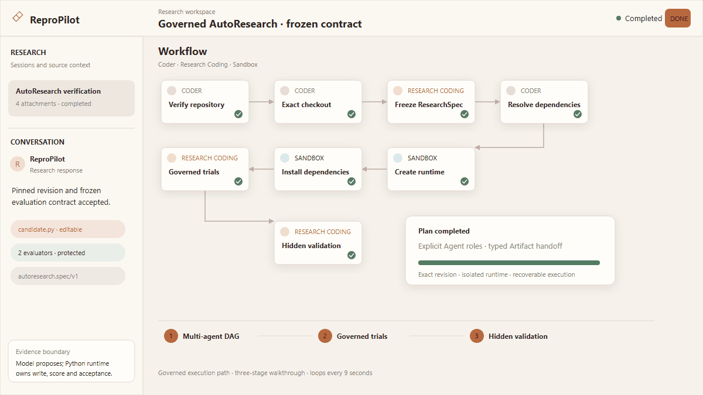
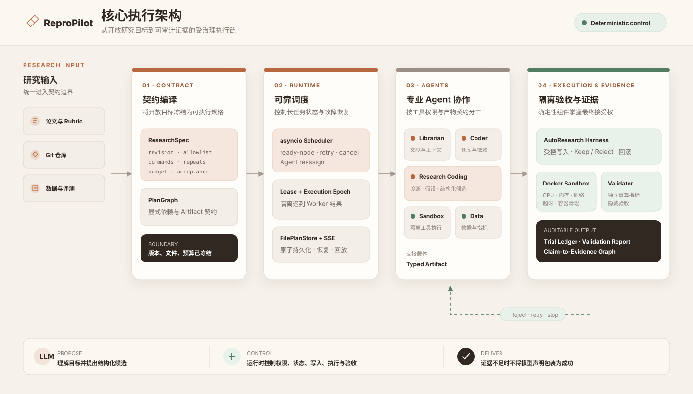

<div align="center">
  <h1>ReproPilot</h1>
  <h3>证据驱动的多 Agent 科研执行系统</h3>
  <p>把论文、仓库与数据任务拆成可执行流程，让多个 Agent 在受控环境中协作完成代码实验与结果验证。</p>
  <p>
    <a href="https://github.com/tutudouzi12/ReproPilot/actions/workflows/ci.yml"></a>
    <a href="https://www.python.org/"></a>
    <a href="https://fastapi.tiangolo.com/"></a>
    <a href="https://react.dev/"></a>
    <a href="https://www.docker.com/"></a>
  </p>
  <p>
    <a href="#四个核心能力">核心能力</a> ·
    <a href="#演示">演示</a> ·
    <a href="#系统如何工作">工作流程</a> ·
    <a href="#核心执行架构">执行架构</a> ·
    <a href="#真实仓库评测证据">评测证据</a> ·
    <a href="#快速启动">快速启动</a>
  </p>
</div>


ReproPilot 关注的不是一次模型问答，而是一条完整的研究执行链：理解目标、拆分任务、准备仓库、修改代码、运行实验、验证结果并保存证据。模型负责理解问题和提出方案，系统负责控制执行过程并检查结果。

## 四个核心能力

### 1. 多 Agent 任务编排与故障恢复

系统将研究任务拆成带依赖关系的 DAG，由不同 Agent 分别处理文献、代码、执行和数据工作，并通过结构化产物交接。运行过程中支持超时、重试、取消、重新分配和服务重启恢复，同时避免已经失效的任务结果覆盖最新状态。

### 2. 受控代码实验

模型负责分析问题并提出代码候选，系统负责限制可以修改的文件、执行统一评测并比较候选效果。只有满足验收条件的修改才会保留，不符合条件的候选会被拒绝或回滚，模型不能自行修改评测规则或宣布成功。

### 3. 结果验证与证据记录

系统不会直接相信模型给出的成功结论，而是重新运行评测并计算指标，同时记录实验配置、候选修改和验收结果。论文主张可以关联到实际运行产物；证据不足、结果冲突或无法验证时会被明确标记。

### 4. Docker 隔离执行

产品运行时支持在独立 Docker 容器中执行代码，系统限制可用资源、网络、执行时间和输出大小，并在任务完成、失败或取消后清理容器。公开的真实仓库 benchmark runner 当前使用环境变量受限的本地子进程，并非网络隔离容器；两种执行边界分别记录，均不等同于面向不可信公网用户的生产级安全沙箱。

## 演示



动图用三幕展示一次受治理实验如何从多 Agent DAG 进入候选筛选，再形成独立验收结果。它用于快速理解系统链路，不在首页展开实验分数；完整案例与证据边界见 [端到端演示文档](docs/end-to-end-demo.md)。

## 系统如何工作

1. **确定任务边界**：固定目标仓库、允许修改的文件、评测方式和实验预算。
2. **生成执行计划**：将任务拆成带依赖关系的步骤，只运行前置条件已经满足的节点。
3. **Agent 分工协作**：文献、代码、执行和数据 Agent 通过结构化产物交接结果。
4. **运行并验收候选**：通过受控执行器运行代码，由系统重新计算指标并决定保留或回滚。
5. **保存实验依据**：记录实验过程、验收结果和论文主张对应的运行证据。

### 核心产物

| 产物 | 作用 |
|---|---|
| 任务规格 | 固定仓库版本、文件边界、评测方式和实验预算 |
| 执行计划与事件记录 | 描述 Agent 依赖、执行状态、恢复过程和实时进度 |
| 实验账本 | 记录候选修改、模型调用和保留或拒绝原因 |
| 验收报告 | 汇总系统重新计算的指标和文件完整性检查 |
| [Hash-linked 实验轨迹](backend/app/trajectory.py) | 按顺序记录 baseline、候选、评测、决策、回滚与最终验收，并绑定终态证据哈希 |
| [结构化运行评估](backend/app/run_assessment.py) | 分别保留 Outcome、Compliance、Process 原始事实；当前不计算主观综合分 |
| 主张—证据图 | 将论文主张关联到论文位置、运行指标和真实产物 |

## 核心执行架构



研究目标首先被整理为明确的执行边界，再由调度器驱动多个专业 Agent 协作。LLM 负责提出候选方案，系统负责文件写入、隔离执行、结果计算和最终验收。更深入的设计原因与限制见 [设计取舍与已知限制](docs/design-decisions.md)。

## 验证状态

| 检查项 | 结果 |
|---|---|
| Backend | [`main@7c59cbf`](https://github.com/tutudouzi12/ReproPilot/commit/7c59cbf425f08f1007085315e9083460952ae9be)：`256 passed, 5 skipped`；行覆盖率门槛 83%，分支覆盖率门槛 68% |
| Docker Sandbox | `7 passed` |
| 有界论文复现 | [fastText AG News](examples/paper-reproduction/fasttext-ag-news/results/2026-08-29-docker/README.md)：固定官方源码、数据哈希与 Docker 环境，3 组 paired runs 得到 `92.433%` bigram accuracy、`+1.133 pp`，两项冻结标准均为 `verified` |
| 产品链 Assessment E2E | [单次真实模型证据包](examples/autoresearch/minimal/results/2026-08-29-product-assessment-e2e/)：HTTP API 驱动 8/8 DAG 节点，公开指标 `0.6667 -> 1.0`，隐藏验收 `3/3`，26 个轨迹事件通过哈希链校验；运行镜像来自未提交工作区，因此明确标记 `release_evidence=false` |
| AutoResearch scenarios | 7 个固定场景覆盖成功、契约拒绝、语法失败、超时、隐藏验收失败与完整性中止 |
| Frontend | ESLint、TypeScript、Vite production build 通过 |
| Dependency audit | `npm audit --omit=dev`：`0 vulnerabilities` |
| Docker Compose | Frontend、Backend、Sandbox 健康启动 |
| Docker smoke | 鉴权、白名单、资源限制、真实执行、超时、截断和清理通过 |
| GitHub Actions | Backend、Sandbox、Frontend 与 Docker smoke jobs |

上述状态区分单元测试、容器 Smoke、单条有界论文主张和真实模型案例；它们不等于公网生产部署、整篇论文完整复现或大规模论文复现成功率。

```powershell
Push-Location backend
py -3.11 -m pytest -q
Pop-Location

Push-Location docker-sandbox
py -3.11 -m pytest -q
Pop-Location

Push-Location frontend
npm ci
npm run lint
npm run build
npm audit --omit=dev
Pop-Location

py -3.11 .\scripts\docker_smoke.py
```

## 真实仓库评测证据

仓库保留了固定版本、任务契约、Baseline、模型用量、候选补丁、自动验收与人工复核证据。以下数字来自已提交的冻结报告，不是从 README 临时统计，也不能外推为通用 Coding Agent 成功率。

| 证据集 | 固定范围 | 已记录结果 |
|---|---|---|
| [多仓库 pilot benchmark](examples/autoresearch/repository-scale/BENCHMARK_REPORT.md) | 7 个任务、6 个独立任务、6 个唯一仓库；其中 1 个对抗任务复用 more-itertools，不计为独立仓库样本 | 选定主运行自动通过 `4/6`，人工接受 `2/6`；按时间顺序的首次运行自动通过与人工接受均为 `1/6` |
| [18-cell 重复 campaign](examples/autoresearch/repository-scale/REPEATED_BENCHMARK_REPORT.md) | 6 个独立任务 × 3 次重复；固定模型、Harness revision、执行顺序与每 cell 请求上限 | 完成 `15/18`，自动通过 `9/18`，`3` 个 incomplete；已知请求尝试 `30`，保守边界 `30–39` |

公开证据不会只保留成功案例：它同时记录候选主动停止、语法/上游测试拒绝、隐藏验收失败、自动通过后人工拒绝、完整性中止、provider 请求失败，以及 runner 未产出结果的 incomplete cell。自动通过只表示满足冻结任务契约，不表示上游维护者会接受、与历史补丁等价或已经达到生产可用水平。

## 快速启动

需要 Docker Desktop 或兼容的 Docker Engine：

```powershell
git clone https://github.com/tutudouzi12/ReproPilot.git
cd ReproPilot
Copy-Item backend.env.example backend.env
docker compose up --build -d
docker compose ps
```

启动后访问 [Research Workspace](http://localhost:5173) 和 [OpenAPI Docs](http://localhost:8080/docs)。使用模型能力时，在本地 `backend.env` 中配置 OpenAI-compatible 接口；该文件已被 Git 忽略：

```dotenv
OPENAI_API_KEY=your-key
OPENAI_BASE_URL=https://your-compatible-endpoint/v1
OPENAI_MODEL=your-model
```

默认使用严格模式。只有显式设置 `OFFLINE_DEMO_MODE=true` 才会生成联调用占位结果；此类结果标记为 `unverified_demo`，不会进入有效研究证据。

## 文档导航

- [端到端演示](docs/end-to-end-demo.md)
- [fastText AG News 有界论文复现](examples/paper-reproduction/fasttext-ag-news/)
- [真实模型产品链 Assessment 证据](examples/autoresearch/minimal/results/2026-08-29-product-assessment-e2e/)
- [固定评测场景套件](examples/autoresearch/evaluation-suite/)
- [多仓库 pilot benchmark](examples/autoresearch/repository-scale/BENCHMARK_REPORT.md)
- [18-cell 重复 campaign](examples/autoresearch/repository-scale/REPEATED_BENCHMARK_REPORT.md)
- [设计说明与已知限制](docs/design-decisions.md)
- [本地启动指南](docs/local_startup_guide.md)
- [用户手册](docs/user_manual.md)

## 已知边界

- 当前运行时面向可靠的单机工作流，不是生产级分布式调度平台。
- 当前身份机制适合本地个人使用，公开部署仍需补充正式认证和权限管理。
- Docker 隔离降低了代码执行风险，但不能替代面向不可信租户的专业安全沙箱。
- 公开的真实仓库 benchmark runner 当前使用环境变量受限的本地子进程，不具备 Docker Sandbox 的网络隔离边界。
- 代码通过既定评测，只能证明当前任务要求被满足，不能自动证明论文结论被完整复现。
