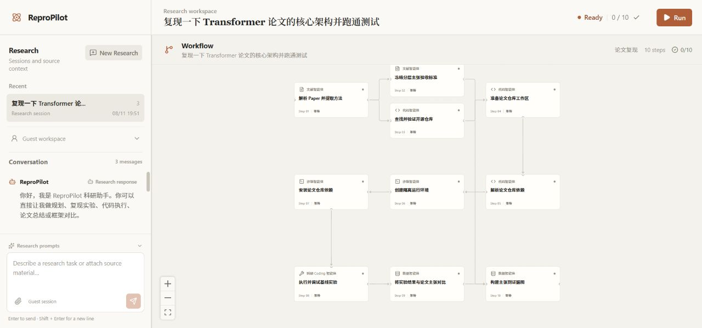
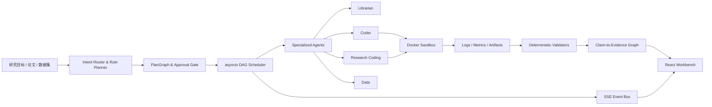

# ReproPilot

[](https://github.com/tutudouzi12/ReproPilot/actions/workflows/ci.yml)
[](https://www.python.org/)
[](https://react.dev/)
[](https://www.docker.com/)
[](LICENSE)

**面向论文复现、代码调试与模型评测的可恢复 Agent 执行平台。**

ReproPilot 将自然语言研究目标编译为可审计的任务 DAG，在受限 Docker Sandbox 中执行真实代码，再通过确定性校验器重算指标、验证 Artifact，并生成 Claim-to-Evidence Graph。它关注的不只是“让 Agent 给出答案”，而是让一次研究任务具备可执行、可恢复、可追踪和可验证的完整闭环。



## 项目概览

科研复现任务往往同时涉及论文解析、仓库发现、依赖安装、代码执行、失败修复、指标对齐和证据整理。单轮对话难以管理这些长链路状态，也无法可靠回答“代码是否真的运行”“指标是否来自逐样本预测”“失败后修改了哪些文件”。

ReproPilot 将这些问题拆成三个相互隔离的层次：

1. **模型负责提出结构化方案**：解析意图、选择 Agent、生成受约束的适配器或最小补丁。
2. **Python Runtime 负责治理执行**：调度 DAG、维护状态与租约、控制预算、持久化事件和恢复中断任务。
3. **确定性组件负责认定结果**：校验路径与哈希、重算指标、验证图片和预测文件、构建证据图。

## 核心架构



| 层次 | 主要职责 | 核心实现 |
|---|---|---|
| Workbench | 对话、DAG、审批、节点日志、PDF 与 Artifact 展示 | React 19、TypeScript、React Flow、SSE |
| API & Planner | 身份与附件校验、意图路由、确定性图模板、模型契约 | FastAPI、Pydantic |
| Agent Runtime | 并发调度、状态机、租约、重试、取消、预算、恢复 | asyncio、自研 DAG Scheduler |
| Research Harness | 仓库准备、依赖恢复、受限补丁、Benchmark 适配与验证 | Python、结构化 Agent 输出 |
| Sandbox | 容器生命周期、资源限制、命令流与执行隔离 | docker-py、独立 FastAPI 服务 |
| Evidence | Rubric 冻结、哈希校验、指标重算、证据关联 | SHA-256、Claim-to-Evidence Graph |

## 关键工程能力

### 1. 可恢复的 DAG Agent Runtime

- Planner 使用可审计的规则路由与图模板，将论文复现、框架评测、代码执行和自有数据 Benchmark 转换为显式依赖图。
- Scheduler 基于 `asyncio` 并发运行 ready 节点，支持优先级、节点超时、有限重试、全图尝试预算和总时长预算。
- 失败节点会阻断其下游依赖；取消、失败、跳过和阻断均拥有独立终态，不用“成功文案”掩盖执行失败。
- 高风险或 full 计划可以进入 `awaiting_approval`，批准后才获得执行权限。

每次节点执行都会绑定：

```text
execution_id + execution_epoch + lease_owner + lease_expires_at
```

任务被取消、重试或转交后，epoch 与租约随之变化。旧协程即使迟到返回，也只会产生 `task_result_discarded` 事件，不能覆盖新状态。

### 2. 原子持久化与事件回放

- `FilePlanStore` 先写临时文件、执行 `fsync`，再通过原子替换提交计划快照。
- 服务启动时会识别上次中断的运行节点，清理过期执行租约并恢复为可重新调度状态。
- 事件流记录节点 ready、start、log、Artifact、终态和计划终态；SSE 重连后可以回放历史事件。
- Session 切换会关闭旧 SSE 连接，避免终止消息串入其他会话。

### 3. 受约束的 Research Coding Agent

ReproPilot 不允许模型直接获得任意文件系统或 Shell 权限。Research Coding 链路将“模型判断”和“实际写入”拆开：

1. Python Harness 收集入口文件、traceback 命中的仓库文件和有限源码上下文。
2. 模型返回 `patched`、`no_change` 或 `unsupported`，以及结构化的文件级修改方案。
3. Runtime 校验目标路径、符号链接、文件大小、禁止副作用和可修改文件集合。
4. 写入前保存原内容与权限，并记录修改前后的 SHA-256。
5. 在同一受限运行时重跑；修复预算耗尽时自动恢复 Agent 修改过的文件。

固定治理边界包括：最多 3 次执行、2 轮修复、每轮最多修改 3 个已提供给模型的 Python 文件；缺少数据、checkpoint、凭证、算力或科学口径不一致时不会伪造补丁或指标。

### 4. 可验证的自有数据 Benchmark Harness

自有数据评测由固定 DAG 驱动，而不是让模型自由宣布成功：

```text
Dataset Profile
      ├── Repository Discovery → Workspace → Dependency Resolution
      └── Adapter Generation
                    ↓
          Preflight & Repair
                    ↓
          Benchmark Execution
                    ↓
       Prediction / Metric Validation
                    ↓
             Evidence Report
```

- 支持 CSV、TSV、JSON、JSONL，以及分类、回归和无标签推理任务。
- `dataset_profile` 使用确定性代码解析列、样本数、任务类型和数据 SHA-256。
- Adapter 生成分为候选入口比较与最终代码生成两个阶段，源码上下文和文件数量均受预算限制。
- 正式执行前最多进行 3 次、每次最多 8 条样本的预检与受限修复。
- 验证器重新读取 `predictions.jsonl`，校验数据哈希、样本数、运行清单和数值范围，并独立重算 `accuracy`、`macro_f1`、`mse` 或 `mae`。
- 适配器、数据或仓库源码在执行期间发生未授权变化时，整次评测失败。

### 5. Claim-to-Evidence Graph

论文主张不会直接从模型文本升级为“已复现”。系统先冻结规范化 Rubric 及其 SHA-256，再允许后续节点引用真实存在的 Artifact：

| 状态 | 含义 |
|---|---|
| `verified` | 现有 Artifact 满足冻结的验收条件 |
| `partially_reproduced` | 只覆盖了部分条件或缩小规模的实验 |
| `contradicted` | 运行结果与目标主张冲突 |
| `unverifiable` | 证据不足，无法做可靠判断 |
| `blocked_by_missing_asset` | 缺少数据、checkpoint 或其他必要资产 |

离线演示结果带有 `unverified_demo` 标记，会被报告、绘图和 Evidence Graph 主动排除，不能混入有效研究证据。

### 6. 独立 Docker Sandbox

Backend 只通过内部 Bearer Token 调用 Sandbox Service。每个任务容器默认应用：

- 镜像白名单与挂载根目录白名单；
- `network_mode=none`，默认关闭网络；
- 1 CPU、512 MiB 内存、128 PIDs；
- `cap-drop ALL` 与 `no-new-privileges`；
- 命令级超时和 UTF-8 安全的输出截断；
- stdout/stderr NDJSON 流与 final 事件；
- 成功、失败、取消后的容器清理与泄漏检查。

运行镜像预装 `torch 2.13.0+cpu`，可在离线容器内执行真实科学计算。GPU 可通过显式 `DeviceRequest` 配置启用。

## 端到端工作流

| 场景 | 执行链路 | 主要产物 |
|---|---|---|
| 论文复现 | 论文解析 → 仓库准备 → 依赖恢复 → 基线执行/调试 → 结果比较 → Claim 审定 | 运行指标、补丁清单、差异报告、证据图 |
| 框架评测 | 框架解析 → 运行时准备 → 受限实验 → 指标与图表生成 | 评测报告、指标 Artifact、可验证 PNG |
| 自有数据 Benchmark | 数据画像 → Adapter 生成 → 预检修复 → 正式执行 → 指标重算 | 数据清单、逐样本预测、运行清单、验证报告 |
| 通用代码执行 | 计划生成 → 审批 → 沙箱执行 → 日志与 Artifact 回传 | stdout/stderr、退出码、执行证据 |

## 验证证据

| 验证层 | 当前结果 |
|---|---|
| Backend | `132 passed, 2 skipped` |
| Docker Sandbox | `7 passed` |
| Frontend | ESLint 与生产构建通过 |
| Dependency Audit | `npm audit --omit=dev`：`0 vulnerabilities` |
| Docker Smoke | 鉴权、白名单、网络隔离、资源限制、真实执行、超时、截断和清理全部通过 |
| GitHub Actions | `test` 与 `docker-smoke` 两个 Job 均通过 |

真实链路验证还包括：

- 在 `karpathy/minGPT` 固定提交 `37baab71b9abea1b76ab957409a1cc2fbfba8a26` 上完成 Repository Preparation。
- 在隔离容器内完成受限前向传播，得到输出形状 `[2, 7, 64]` 和参数量 `167680`，运行后无沙箱容器泄漏。
- Benchmark Harness 完成 preflight、execution 和 validation，并从逐样本预测重新计算 `accuracy=0.5`、`macro_f1=0.3333333333333333`。
- 严格模式缺少模型、仓库或 Sandbox 时保留真实失败原因，不生成伪成功结果。

## 技术栈

| 范围 | 技术 |
|---|---|
| Frontend | React 19、TypeScript 5.9、React Flow、Tailwind CSS 4、Vite 8、PDF.js |
| Backend | Python 3.11、FastAPI、Pydantic、Uvicorn |
| Runtime | asyncio、自研 DAG Scheduler、SSE、JSON Atomic Snapshot |
| Agent | OpenAI-compatible Chat Completions、结构化输出契约、ReAct 修复、预算受限 ToT |
| Sandbox | Docker、docker-py、独立 FastAPI Service、PyTorch CPU |
| Quality | pytest、ESLint、TypeScript、npm audit、GitHub Actions |

## 快速开始

### Docker Compose

需要 Docker Desktop 或兼容的 Docker Engine。

```powershell
git clone https://github.com/tutudouzi12/ReproPilot.git
cd ReproPilot
Copy-Item backend.env.example backend.env
docker compose up --build -d
docker compose ps
```

服务地址：

- Web Workbench：`http://localhost:5173`
- Backend API：`http://localhost:8080`
- OpenAPI Docs：`http://localhost:8080/docs`
- Sandbox Health：`http://localhost:8082/api/v1/health`

需要模型能力时，在 `backend.env` 中配置 OpenAI-compatible 接口：

```dotenv
OPENAI_API_KEY=your-key
OPENAI_BASE_URL=https://your-compatible-endpoint/v1
OPENAI_MODEL=your-model
```

默认 `OFFLINE_DEMO_MODE=false`。严格模式下，缺少模型或可信执行条件的节点会失败并保留错误证据。只做界面与 DAG 联调时可以显式启用演示模式，但其产物不会成为有效证据。

### 本地开发

需要 Python 3.11+、Node.js 20+ 和 Docker。

```powershell
Copy-Item backend.env.example backend.env

py -3.11 -m pip install -e ".\backend[dev]"
py -3.11 -m pip install -e ".\docker-sandbox[dev]"

.\scripts\windows\start-sandbox.ps1
.\scripts\windows\start-backend.ps1
.\scripts\windows\start-frontend.ps1
```

Windows 与 Unix 的启动脚本都位于 [`scripts/`](scripts/) 目录。

## 运行示例

论文复现：

```text
复现 Attention Is All You Need 的核心 attention 实验，
使用指定 GitHub 仓库运行 smoke 模式，并生成指标对比和 Claim-Evidence 报告。
```

自有数据 Benchmark：

```text
用 https://github.com/OWNER/REPOSITORY 跑 benchmark，
输入列是 review，标签列是 label，最多运行 500 条样本。
```

系统会先生成 DAG；需要审批的计划必须批准后才会进入真实执行阶段。

## 测试与质量检查

```powershell
Push-Location backend
py -3.11 -m pytest -q
Pop-Location

Push-Location docker-sandbox
py -3.11 -m pytest -q
Pop-Location

Push-Location frontend
npm ci
npm run lint
npm run build
npm audit --omit=dev
Pop-Location
```

Compose 启动后执行真实 Docker 验收：

```powershell
py -3.11 .\scripts\docker_smoke.py
```

## 项目结构

```text
ReproPilot/
├── backend/
│   ├── app/
│   │   ├── planner.py              # 意图路由与 DAG 模板
│   │   ├── scheduler.py            # 调度、租约、预算与恢复
│   │   ├── agents.py               # Agent 路由与执行契约
│   │   ├── research_coding.py      # 受限补丁、回滚与重跑
│   │   ├── benchmark*.py           # 数据契约、执行与指标验证
│   │   ├── claim_evidence.py       # Rubric 与 Evidence Graph
│   │   └── store.py                # 原子计划快照
│   └── tests/
├── docker-sandbox/                 # 独立隔离执行服务
├── frontend/                       # React Agent Workbench
├── docs/                           # 架构、用户手册与设计文档
├── examples/                       # 最小复现示例
├── scripts/                        # 启动与 Docker Smoke 脚本
├── docker-compose.yml
└── backend.env.example
```

## 工程边界

- 计划与事件当前使用单机 JSON 原子快照；多实例部署需要替换为数据库与分布式租约。
- Sandbox 通过 Docker Socket 创建任务容器，适合受控开发和评测环境；不应直接作为不可信多租户隔离边界。
- 私有仓库认证、需要人工许可的数据、私有 checkpoint、交互式 GUI 和高度定制的数据加载协议需要额外集成。
- 代码修复成功只证明对应执行错误已消除，不自动证明论文方法、数据口径和科学结论已经完整复现。

## 文档

- [系统架构](docs/project_architecture.md)
- [Research Coding Agent 与 Benchmark Harness](docs/research_coding_agent.md)
- [Claim-to-Evidence Graph](docs/claim_evidence_graph.md)
- [ToT 消融、上传与安全边界](docs/tot_ablation_and_uploads.md)
- [本地启动指南](docs/local_startup_guide.md)
- [用户手册](docs/user_manual.md)
- [贡献指南](docs/CONTRIBUTING.md)

## License

[MIT](LICENSE)
